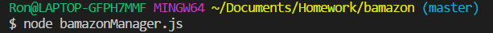
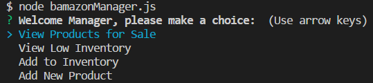
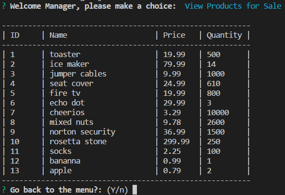
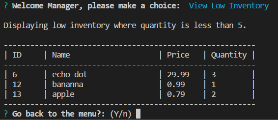
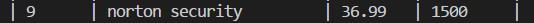
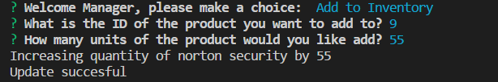
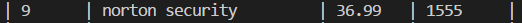
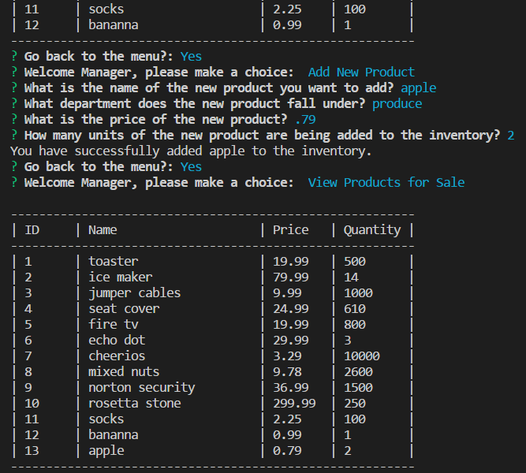

# bamazon
Like amazon but with a b

# Customer experience: 

run bamazonCustomer.js with node in your console 

It will connect to a mysql db,
Displays some of the db info &
Prompts for the item & quantity you want to purchase 

After entering the info, it will either make the purchase and advise how much you spent, 
or advise there is insufficient quantity 

# Manager experience

run bamazonManager.js with node in your console  

It will connect to a mysql db,
&
prompt you to take some actions 

Select view products, and it will display the products 

Select view low inventory, and it will display items with quantity less than 5 

Select add to inventory, and it will propmt you to enter the id of an item and the quantity you want to add   

Select Add new product, and it will prompt you for the necessary data to add a new product, then add it 

