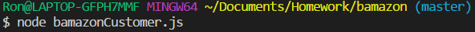

# bamazon
Like amazon but with a b

# Customer experience: 

run bamazonCustomer.js with node in your console 

It will connect to a mysql db,
Displays some of the db info &
Prompts for the item & quantity you want to purchase 

After entering the info, it will either make the purchase and advise how much you spent, or advise there is insufficient quantity 

